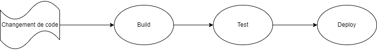
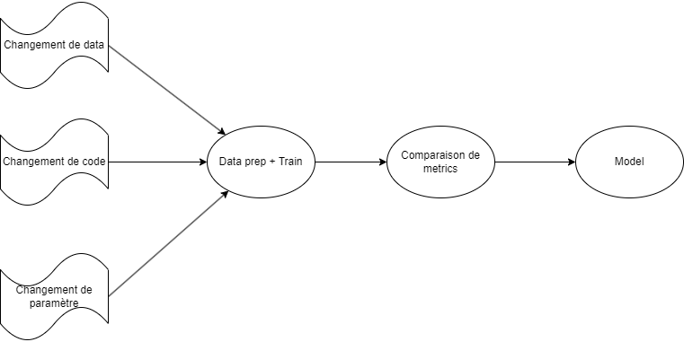
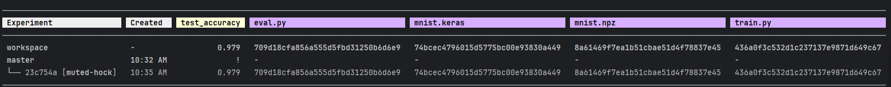
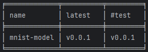

La méthodologie GitOps consiste à n'avoir qu'une seule source de vérité centralisée dans un repository Git. 
Le code source du projet, les fichiers de description de l'infrastructure ou la configuration de la pipeline CI/CD sont conservés au même endroit. 

L'utilisation d'un gestionnaire de code comme Git offre plusieurs avantages :

- Le travail collaboratif est fluidifié. Le code source est partagé facilement entre les différents membres de l'équipe et il y a peu de différences entre les environnements de développements de chacun. De plus, les évolutions peuvent être soumises à l'approbation des autres membres par le biais d'une merge request.
- Il est très simple de reproduire le comportement d'une application à un instant donné. Il suffit de récupérer la version correspondante du code source et de l'exécuter. Il peut très bien s'agir d'une version antérieure à la branche principale.
- Il est possible de parcourir l'historique du projet et de retracer ses évolutions.

En bénéficiant des avantages de Git, en particulier celui lié à la reproductibilité, la méthodologie GitOps permet de mettre en place des déploiements continus (automatiques et systématiques), tout en conservant une fiabilité d'exécution. Ces déploiements sont souvent séparés en trois étapes. 

- **Build** : récupération du commit Git correspondant, installation des dépendances externes (frameworks, librairies…) puis compilation si nécessaire.
- **Test** : exécution partielle ou totale de l'application pour vérifier que son comportement est conforme aux attentes. 
- **Deploy** : une nouvelle version de l'application est déployée sur un environnement cible.

L'exécution d'une telle pipeline ne dépend que du code source pour pouvoir s'exécuter. Chaque changement de code peut déclencher une nouvelle itération.



En cas d'échec, il suffira de déclencher la pipeline en se basant sur le commit précédent.

Bien qu'une telle architecture semble simple à implémenter, les projets de Machine Learning présentent des spécificités qui peuvent complexifier sa mise en œuvre.

## Application sur un projet de Machine Learning

Dans un projet de Machine Learning, on est dépendant d'éléments extérieurs au code source, notamment de données ou des hyperparamètres qui peuvent être modifiés régulièrement.
Git n'étant pas conçu pour gérer de la grosse volumétrie, il n'est pas judicieux d'y versionner nos données.

En ce qui concerne les hyperparamètres, chaque changement marquera l'historique Git.
Si des changements sont réguliers et éphémères, il sera intéressant de les partager sans polluer notre historique.

Pour pouvoir bénéficier des intérêts de la méthodologie GitOps, il faudra être capable de retrouver la donnée et les paramètres ayant abouti à la génération d'un modèle pour pouvoir relancer le même entraînement.
Il faudra donc lier notre code source et l'ensemble des dépendances extérieures pour pouvoir retrouver la même reproductibilité que sur un projet classique.
De même, il faudra garder une trace des dépendances utilisées au moment de l'exécution d'un entraînement.

Une fois que ces problématiques seront résolues, on pourra mettre en place un mécanisme de déploiement continu, avec des étapes équivalentes au build, test, deploy :

- **Data prep + Train** : il s'agit de l'équivalent du build. On va prendre en entrée des données brutes, les traîter et les exploiter pour construire un modèle. Cette étape se terminera par l'exportation du modèle dans un fichier.
- **Évaluation** : ici, on va collecter des métriques pour mesurer la performance de notre modèle. Cette étape équivaut à celle du test.
- **Déploiement** : on va déposer le modèle dans un registry ou un stockage distant.

Ainsi, on sera capable d'automatiser notre workflow pour accélérer et fiabiliser nos déploiements.



Pour résumer, nous sommes à la recherche d'un outil qui nous permettra de : 

- Lier le code source et la donnée
- Expliciter les valeurs des paramètres et les fichiers de donnée utilisés
- Définir les différentes étapes de notre pipeline
- Partager rapidement notre travail aux autres membres de l'équipe

Pour cela, je vous propose d'utiliser DVC.

## Data Version Control

DVC est un outil de ligne de commande sous licence Apache v2.0, développé par Iterative dont la première version est apparue en 2017. 

Cet outil fonctionne conjointement avec Git et l'enrichit de fonctionnalités supplémentaires.
Il offre la possibilité de tracker des fichiers volumineux et conserve le nommage de commandes de Git (`dvc add` pour tracker un fichier, `dvc push` pour le partager en remote, `dvc pull` pour récupérer ce qui est présent sur le stockage distant, etc.). 

Il permet de partager du code sans avoir besoin de passer par des commits ainsi que de définir et d'exécuter une pipeline pour entraîner ses modèles.

Ces fonctionnalités non exhaustives permettent de faire de son repository Git le point central pour gérer le cycle de vie de son projet de ML. 

## Versionning de données

Commençons par regarder comment DVC gère le versioning de données en prenant pour exemple le célèbre projet MNIST avec Keras : une reconnaissance d'images manuscrites des chiffres allant de 0 à 9. Ainsi, nous pourrons nous concentrer sur les features de DVC et non pas sur la construction du modèle.

Dans un nouveau dossier :

```bash
git init
dvc init
```

Commençons par récupérer nos données d'entraînement et de test :

```bash
curl https://storage.googleapis.com/tensorflow/tf-keras-datasets/mnist.npz -o mnist.npz
```

Ensuite, nous avons besoin d'un script `train.py` pour entraîner notre modèle :

```python
from keras import models, layers
from keras.utils import to_categorical
import numpy as np

with np.load("mnist.npz", allow_pickle=True) as f:
    train_images, train_labels = f["x_train"], f["y_train"]

train_images = train_images.reshape((60000, 28 * 28)).astype('float32') / 255
train_labels = to_categorical(train_labels)

model = models.Sequential()
model.add(layers.Dense(512, 'relu', input_shape=(28 * 28,)))
model.add(layers.Dense(10, 'softmax'))

model.compile('rmsprop', 'categorical_crossentropy', ['accuracy'])
model.fit(train_images, train_labels, epochs=5, batch_size=128)
model.save("mnist.keras")
```

Le script utilise les data de mnist.npz pour construire un modèle et l'exporte dans le fichier `mnist.keras `.

Les données d'entrée et le modèle généré sont binaires et volumineux (plusieurs Mo dans notre exemple, mais ça pourrait être beaucoup plus dans un projet réel). Nous n'allons pas les versionner dans Git mais dans DVC, en commençant par `mnist.npz`.

```bash
dvc add mnist.npz
```

`mnist.npz` a été automatiquement ajouté dans `.gitignore` et un fichier `mnist.npz.dvc` a été créé. Ce dernier ne contient que quelques métadonnées, dont un hash. On peut donc le versionner dans Git.

Si on `git commit` puis `git push` notre dossier courant, un autre utilisateur ne pourra pas récupérer le fichier `mnist.npz`.
Pour y remédier, DVC s'intègre à plusieurs solutions de stockage, à savoir des services provenant de cloud providers (S3, Blob Storage ou Google Cloud Storage), des solutions on premise (SSH, HDFS, etc.) mais aussi le système de fichier local, ce que nous utiliserons dans cet exemple.

```bash
dvc remote add -d origin ~/.dvcstore
dvc push
```

Si on regarde le contenu du dossier `~/.dvcstore/files/md5`, on pourra retrouver le fichier `mnist.npz`, dont le nom est celui du hash présent dans `mnist.npz.dvc`. 

Un autre utilisateur ayant accès au stockage distant pourra exécuter les commandes suivantes pour récupérer le code source et la data :

```bash
git clone <git-repository>
dvc pull
```

Si le fichier `mnist.npz` évoluait, en répétant la même manœuvre, le hash du fichier serait différent et une deuxième version serait déposée dans le stockage distant. DVC peut retrouver la version correspondant au commit git en récupérant le hash inscrit dans `mnist.npz.dvc`.

## Pipeline

Une pipeline de Machine Learning peut souvent être découpée en plusieurs étapes (par exemple : data prep, train, evaluate, deploy). DVC permet de définir les étapes nécessaires pour exécuter un entraînement avec leurs dépendances, paramètres et données de sorties.

Nous allons illustrer le concept en ajoutant une étape d'évaluation.

Créons un fichier `eval.py` avec pour contenu :

```python
from keras import models
from keras.utils import to_categorical
import numpy as np

with np.load("mnist.npz", allow_pickle=True) as f:
    test_images, test_labels = f["x_test"], f["y_test"]

test_images = test_images.reshape((10000, 28 * 28))
test_images = test_images.astype('float32') / 255
test_labels = to_categorical(test_labels)

network = models.load_model("mnist.keras")
test_loss, test_acc = network.evaluate(test_images, test_labels)

with open("metrics.json", "w", encoding="utf-8") as f:
    f.write(f"{{'test_acc': {test_acc}}}\n")
```

Le script évalue notre modèle et exporte l'accuracy dans le fichier `metrics.json`.

Créons ensuite un fichier `dvc.yaml` :

```yaml
stages:
  train:
    cmd: python3 train.py
    deps:
    - train.py
    - mnist.npz
    outs:
    - mnist.keras
  evaluate:
    cmd: python3 eval.py
    deps:
    - eval.py
    - mnist.npz
    - mnist.keras
    metrics:
    - metrics.json
```
On définit deux étapes d'exécution dans la rubrique stage : *train* et *evaluate* avec des dépendances et des outputs. Pour lancer l'intégralité de notre pipeline (ou experiment), on peut utiliser :

```bash
dvc exp run
```

Avant de lancer une étape, DVC vérifie si au moins une de ses dépendances a changé depuis la dernière exécution. Ainsi, si on avait une étape de *data prep* qui ne dépendrait que des données extérieures, elle ne serait relancée qu'en cas de modification de ces dernières. 

Pour afficher la liste des experiments préalablement exécutées avec leurs résultats, on peut exécuter :

```bash
dvc exp show
```

Pour chaque experiment, on peut consulter les valeurs des métriques exportées avec les hash des fichiers trackés par DVC.



À chaque exécution d'un experiment, DVC crée un objet Git dans le dossier `.git/refs/exps`.
Ces objets sont associés à des fichiers de commits. Ils sont présents dans le système de fichier interne de notre repository Git, mais ne sont pas visibles dans l'historique.
Par ce mécanisme, DVC peut retrouver l'état exact du code source et des dépendances au moment de l'exécution de l'experiment. 

Pour reprendre un experiment, on peut utiliser (commande équivalente à `git checkout`) :

```bash
dvc exp apply <experiment-name>
```

Partager les experiments :

```bash
dvc exp push
```

Ainsi, un autre membre de l'équipe pourra simplement reprendre notre travail en appliquant :

```bash
dvc exp pull
dvc exp apply <experiment-name>
```

## Gestion des paramètres

Dans le fichier de description de pipeline (dvc.yaml), il est possible de déclarer des paramètres externes.
On peut les définir dans un fichier params.yaml et les importer ensuite dans les étapes qui en ont besoin. 

Par exemple, on pourrait exporter le batch size dans un paramètre comme ceci dans `params.yaml` :

```yaml
batch_size: 128
```

Référencer dans `dvc.yaml` :

```yaml
stages:
  train:
    cmd: python3 train.py
    params:
    - batch_size
```

Accéder dans `train.py` :

```python
import dvc.api
params = dvc.api.params_show()
...
model.fit(train_images, train_labels, epochs=5, batch_size=params["batch_size"])
```

Au lancement de l'experiment, on peut donner une valeur au paramètre :

```bash
dvc exp run --set-param batch_size=16
```

Les valeurs utilisées pour chaque experiment sont conservées dans ses métadonnées.

## Partage de modèles

En ce qui concerne l'organisation et le partage de modèles, il existe plusieurs solutions. La première est de considérer le fichier de modèle comme un quelconque fichier tracké par DVC. Une fois le fichier présent sur le stockage distant, on pourra le télécharger par la commande :

```bash
dvc get <repository-url> <model-file>
```

*repository-url* peut pointer vers un dossier local ou un repository Git distant qui contient le projet DVC.

Une autre option est de déclarer un artefact dans `dvc.yaml` :

```yaml
artifacts:
  mnist-model:
    path: mnist.keras
    type: model
```

Pour récupérer notre artefact, il va falloir tagger le commit Git correspondant en respectant un format bien particulier. Pour nous simplifier la tâche, on peut passer par un deuxième outil de ligne de commande également développé par Iterative : GTO. Cet outil permet de donner à un commit des informations sur les artefacts générés (un nom, un numéro de version, un environnement sur lequel déployer le modèle, etc.). 

Par exemple, pour associer le dernier modèle généré à un environnement de test, on peut exécuter :

```bash
gto register mnist-model
gto assign mnist-model --stage test
```

Les deux commandes créeront chacune un tag sur notre commit courant. 

La commande `gto show` nous donnera le résultat suivant :



DVC peut donc identifier la version du modèle à déployer sur l'environnement de test. On pourra le récupérer avec la commande :

```bash
dvc artifacts get sandbox mnist-model --stage test
```

## API DVC Live

Si on préfère déclarer les artefacts, metrics ou paramètres directement dans le code source au lieu du fichier `dvc.yaml`, il existe une API Python appelée DVC Live. À la fin d'une exécution d'un experiment, le fichier `dvc.yaml` sera mis à jour automatiquement pour inclure les données loguées par l'API.

Par exemple, pour exporter `mnist.keras` dans un artefact, on utilisera :

```python
from dvclive import Live
...
with Live("results/train") as live:
    model.save("mnist.keras")
    live.log_artifact("mnist.keras", type="model")
```

Pour la métrique, on pourra utiliser :

```python
from dvclive import Live
...
with Live("results/eval") as live:
    live.summary['test_acc'] = test_acc
```

L'API DVC Live s'intègre aux principaux frameworks de Machine Learning. Il suffit d'un simple appel de fonction pour collecter des métriques pertinentes.
Dans notre projet, on pourrait appeler une fonction de retour pour obtenir l'évolution de l'accuracy au cours de l'entraînement.

```python
from dvclive.keras import DVCLiveCallback
...
model.fit(train_images, train_labels, epochs=5, batch_size=128,
          callbacks=[DVCLiveCallback()])
```

## Conclusion

Dans beaucoup de projets de Machine Learning, on s'intègre à des plateformes dédiées pour exécuter et partager le code du projet.
Ces plateformes requièrent souvent de l'infrastructure supplémentaire (plusieurs backends, une base de données, etc.).
Avec cette approche, la plateforme pilotera complètement notre projet. 

DVC se démarque de ses concurrents en proposant au contraire une approche où le repository Git reste la source de vérité principale.
Il n'y a pas besoin de provisionner une infrastructure spécifique pour faire vivre le projet.
En ne dépendant que d'un outil de contrôle de version et d'un stockage, un peut obtenir tous les avantages de la méthodologie GitOps.

---

**Liens utiles :**

- [DVC](https://doc.dvc.org/)
- [GitHub - DVC](https://github.com/treeverse/dvc)
